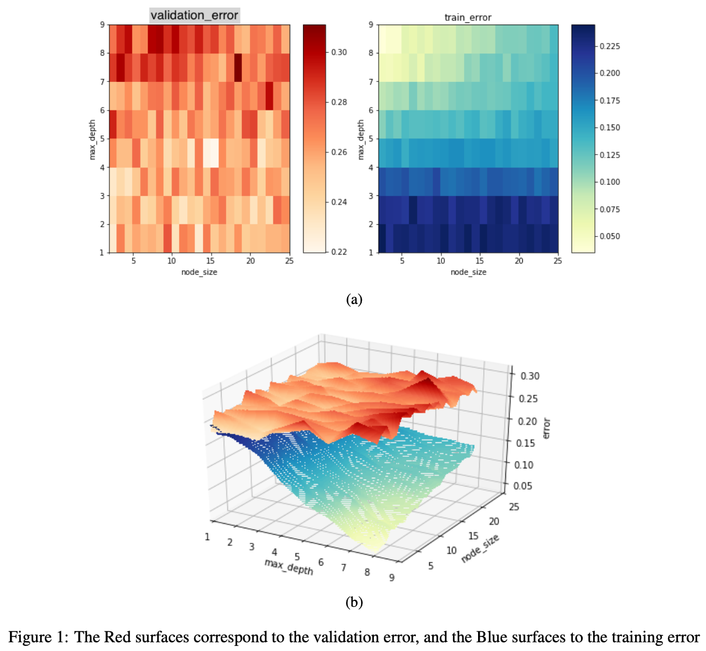
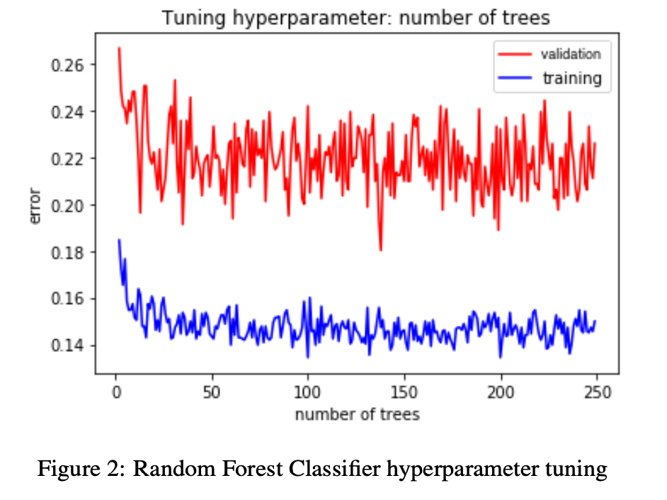

# decision-tree

%--------------------------------------- Data -----------------------------------------%

The Pima Indian Diabetes dataset found Pima-Data-Adjusted.mat is from the UC Irvine Machine Learning Database at https://archive.ics.uci.edu/ml/datasets.php. 
The first 8 columns are the features and the last column represents the class label ( diabetes = , not diabetic= ). 

Note that we adjusted the data from the database to remove entries with missing data, and these data have been normalized. 

%--------------------------------------- Goal for Project -----------------------------------------%

We use 5-fold cross validation to tune hyperparameters, e.g., by using a 70/30 train/val split. 

### Model 1: A decision tree

In this model we train a decision tree to determine if patients are diabetic or not. 

We tune the hyperparameters: maximum depth (max\_depth) AND minimum node size (min\_samples\_split), in order to gain in error reduction. 

Lastly, we report the validation and training error. 

### Model 2: A random forest

In this model we train a random forest to determine if patients are diabetic or not. 

We use the optimal hyperparameters from Model 1 to define the trees.

We tune the hyperparameter `n_estimators', i.e., the number of trees. 

Lastly, we report the validation and training error. 

%--------------------------------------- Required Packages -----------------------------------------%
```
from scipy.io import loadmat

from sklearn.ensemble import RandomForestClassifier
from sklearn.tree import DecisionTreeClassifier
from sklearn.model_selection import train_test_split
from sklearn.metrics import accuracy_score

import matplotlib.pyplot as plt
from matplotlib import cm

from mpl_toolkits.mplot3d import Axes3D

import numpy as np
```

%--------------------------------------- Results -----------------------------------------%

### Model 1: Decision Tree

Since there are 8 features of the data, at maximum we could expect 8 layers in a Decision Tree. At minimum it should be 1, which would correspond to one root node and 8 subsequent nodes in the single layer. For minimum node size the smallest amount of data accepted is two samples, and we continued to look up to 25 samples required to split the node.

For each combination of maximum depth and minimum node size, we performed a 5-fold cross-validation. At each cross-validation this entails randomly splitting the training and validation data 70% and 30% respectively. We then trained our decision tree with a combination of hyperparameters. After 5 cross-validations we averaged the errors.

After looking at all the depth and node combinations, we plot the errors on Figure 1a. To determine the best hyperparameters we are looking for a gain in error reduction, or a minimum validation error while having our training error decreasing. This is more easily seen in Figure 1b, where the best hyperparameters are:
$$(node\\_size, max\\_depth) = (15, 4).$$
These hyperparameters are then used in Model 2: Random Forest.



### Model 2: Random Forest
For this model we use 4-layer trees with minimum node size 15 and we would like to determine the optimal number of trees per forest, denoted by $number\\_of\\_trees$. To determine the best $number\\_of\\_trees$, we again perform 5-fold cross-validation. This process trains 5 random forests, each with $number\\_of\\_trees$ trees, and then averages the 5 errors. This repeats for $number\\_of\\_trees$ to take on any value from 2 to 250. The generated error plot for all values of $number\\_of\\_trees$ is shown in Figure 2. The gain in error reduction for this hyperparameter occurs at 137, so if we were to deploy our Random Forest model we would want to set
$$(node\\_size, max\\_depth, number\\_of\\_trees) = (15, 4, 137).$$


